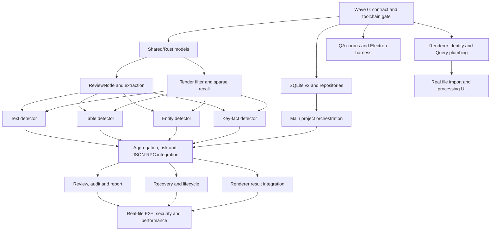

# BidLens V0.3 Implementation Task Breakdown

> Date: 2026-07-21
> Status: execution plan
> Product authority: `docs/product/PRD-v0.3-similarity-risk-review.md`
> Scope: V0.3.0 base workflow, V0.3.1 semantic enhancement, V0.3.2 quality and release hardening

## 1. Goal

Deliver a local, explainable, multi-submission similarity risk review product in three releases:

- **V0.3.0:** complete non-Embedding workflow using text, table, entity and key-fact detectors.
- **V0.3.1:** local BGE-M3 semantic recall and hybrid reranking.
- **V0.3.2:** gold-set calibration, performance, security and release validation.

This plan separates work that can run concurrently from contract, migration and integration gates that must remain serial.

## 2. Current Baseline

Reusable:

- V0.2.2 DOCX/text-PDF parsing, Diff, encryption, SQLite, review and report foundations.
- VNext project, matrix, finding and evidence UI components.
- Initial Shared risk types and `risk:*` IPC.
- Existing table-diff engine.

Incomplete or incorrect:

- Risk projects live only in a Main-process `Map`.
- Project status, analysis phase and submission status are conflated.
- ReviewDecision is embedded in RiskFinding and `important` is modeled as a status.
- Evidence lacks complete AST/ReviewNode/page/table location and currently may contain only one submission side.
- Renderer project identity is split across stores; recovery, review and report controls are not connected.
- Rust has no V0.3 analysis core; current Diff IDs are random and the main matcher is pairwise Jaccard.
- No risk-project database schema, repositories, checkpoints or real Electron E2E exist.

## 3. Parallel Execution Rules

### 3.1 Contract-first gate

No detector, persistence schema or production Renderer mutation may merge before the V0.3.0 contract gate is approved.

The gate freezes:

- ReviewNode, Entity, KeyFact and source location.
- ProjectStatus, AnalysisPhase and SubmissionProcessingState.
- DetectorCandidate, DetectorHit and score breakdown.
- Evidence, RiskFinding, FilePairAssessment and ProjectRiskAssessment.
- ReviewDecision, DetectorRun, Checkpoint, AuditEvent and report metadata.
- IPC commands, responses, progress and structured errors.
- Shared-to-Rust JSON fixtures and field mapping.

### 3.2 File ownership

| Hotspot | Single owner until gate merge |
|---|---|
| `packages/shared/src/risk-review.ts` | Contract owner |
| `packages/shared/src/ipc.ts` and `types-only.ts` | IPC owner |
| `bidlens-engine/Cargo.toml` and root service | Rust integration owner |
| `apps/desktop/src/main/db/schema.ts` and migrations | Database owner |
| `apps/desktop/src/main/services/risk-review-service.ts` | Main orchestration owner |
| `apps/desktop/src/preload/index.ts` | IPC integration owner |
| `apps/desktop/src/renderer/app/App.tsx` | Renderer navigation owner |

Parallel workers own separate crates, repositories, feature folders or test suites. They must not edit another stream's hotspot without handoff.

### 3.3 Merge discipline

1. Merge each wave's contract/infrastructure gate first.
2. Rebase parallel streams on the gate SHA.
3. Run focused tests in each stream.
4. Merge through one integration owner per wave.
5. Run the wave exit gate before starting dependent work.

Do not parallelize dependent review before its producer branch or worktree is complete and visible.

## 4. Dependency Graph



## 5. Workstreams

| Stream | Ownership | Primary areas |
|---|---|---|
| CT | Contracts | Shared risk types, IPC, Rust field fixtures |
| RS | Rust analysis | ReviewNode, recall, detectors, aggregation and risk |
| DB | Persistence | Schema, repositories, Worker, encryption and retention |
| RT | Main runtime | Orchestration, checkpoints, lifecycle, report and audit |
| UI | Renderer | Navigation, Query/mutations, processing, evidence and report |
| QA | Quality | Sanitized files, integration, Electron E2E, security and performance |
| DOC | Documentation | API, architecture, roadmap and release evidence |

## 6. V0.3.0 Execution Waves

### Wave 0 - Contract And Toolchain Gate

These tasks are serial at the final review point, although drafting and fixture preparation can overlap.

| ID | Pri | Task | Owner | Depends | Size | Acceptance |
|---|---|---|---|---|---|---|
| V3-000 | P0 | Pin and document the Rust toolchain. The workspace uses edition 2024, so align CI and docs to a compatible compiler rather than Rust 1.75. | RS | none | S | Clean build uses one documented toolchain on developer and CI Windows environments. |
| V3-001 | P0 | Freeze V0.3.0 domain semantics and names against the PRD. | CT | none | M | One reviewed field dictionary covers states, nodes, detector output, evidence, risk, review and checkpoints. |
| V3-002 | P0 | Define canonical Shared contracts and remove the overloaded `AnalysisProjectStatus`/review-state semantics. | CT | V3-001 | L | Shared compiles; `important` is independent; partial/incomplete and source location are explicit. |
| V3-003 | P0 | Define typed `risk:*` commands, responses, events and structured errors. | CT | V3-002 | M | No untyped IPC request remains; each subscription returns unsubscribe. |
| V3-004 | P0 | Create Shared/Rust canonical JSON fixtures and camel/snake mapping tests. | CT + RS | V3-002 | M | TypeScript and Rust deserialize the same fixtures and preserve enum/field identity. |
| V3-005 | P0 | Approve SQLite v2 logical schema, AAD record identities and deletion/reference rules. | DB | V3-002 | M | Schema review covers projects, versions, snapshots, results, reviews, checkpoints, audit and reports. |
| V3-006 | P0 | Define the sanitized real-file QA corpus and expected evidence assertions. | QA | V3-001 | M | Corpus covers DOCX, text PDF, mixed format, baseline/no-baseline, 2/8 files and failure samples. |

**Wave 0 exit gate**

```powershell
pnpm --filter @bidlens/shared build
pnpm --filter @bidlens/shared test
cargo test --manifest-path bidlens-engine/Cargo.toml field_mapping
git diff --check
```

No Wave 1 producer merges before V3-002 through V3-005 are approved.

### Wave 1 - Foundations In Parallel

After the contract gate, four streams can run concurrently.

#### Stream A: Shared And Rust Models

| ID | Pri | Task | Owner | Depends | Size | Acceptance |
|---|---|---|---|---|---|---|
| V3-101 | P0 | Implement `review-core` types, stable IDs, normalization and complete AST traversal including Section, List and Table location. | RS | V3-004 | L | Same inputs/versions produce byte-stable node IDs and order; source paths/pages survive. |
| V3-102 | P0 | Implement business labels and entity/key-fact extraction primitives in `review-core`. | RS | V3-101 | L | Strong entities normalize exactly; facts retain original and normalized values; weak names retain context. |
| V3-103 | P0 | Add root `risk.*` JSON-RPC skeleton, capability handshake, structured errors, progress and cancellation plumbing. | RS integration | V3-004 | L | Skeleton accepts canonical project input and emits deterministic staged events without detector logic. |

#### Stream B: SQLite And Repositories

| ID | Pri | Task | Owner | Depends | Size | Acceptance |
|---|---|---|---|---|---|---|
| V3-111 | P0 | Add forward-only schema v2 migration without editing v1 SQL/checksums. | DB | V3-005 | L | Existing compare database upgrades and history remains readable. |
| V3-112 | P0 | Implement project, DocumentVersion/snapshot, checkpoint, result, ReviewDecision, audit and report repositories. | DB | V3-111 | XL | Repository integration tests survive process restart and enforce references. |
| V3-113 | P0 | Extend database Worker operations and encrypted payload handling for AST, ReviewNode, Evidence, checkpoints, notes and report paths. | DB | V3-111 | L | Database and WAL contain no plaintext fixtures; encryption failure leaves no half-written record. |
| V3-114 | P1 | Extend retention and transactional project deletion with shared DocumentVersion reference counting. | DB | V3-112 | M | Deleting one project never removes a version still referenced elsewhere. |

#### Stream C: Renderer Identity And Data Plumbing

| ID | Pri | Task | Owner | Depends | Size | Acceptance |
|---|---|---|---|---|---|---|
| V3-121 | P0 | Establish one canonical active project ID and status-aware routing. | UI navigation | V3-003 | M | New project reaches processing; ready/partial opens results; running/interrupted routes correctly. |
| V3-122 | P0 | Centralize project Query keys, progress subscription and invalidation/update behavior. | UI data | V3-003 | M | Processing, list and result read one current snapshot; subscriptions are cleaned up. |
| V3-123 | P0 | Fix hook ordering and remove production `console.log` command stubs. | UI data | V3-121 | S | Loading-to-loaded transitions do not violate Hook ordering; no command silently logs instead of executing. |
| V3-124 | P1 | Replace the fake virtual list with TanStack Virtual and add DOM-count/scroll tests. | UI performance | V3-002 | M | 1000+ findings render a bounded DOM and keyboard selection remains stable. |

#### Stream D: QA Infrastructure

| ID | Pri | Task | Owner | Depends | Size | Acceptance |
|---|---|---|---|---|---|---|
| V3-131 | P0 | Add an Electron Playwright harness, isolated userData/database/export directories and safeStorage test strategy. | QA | V3-006 | L | Test starts packaged/dev Electron and can invoke real preload IPC. |
| V3-132 | P0 | Add production-bundle fixture reachability scanning. | QA | V3-006 | S | Build fails if test project IDs or fixture builders enter reachable production chunks. |
| V3-133 | P1 | Add deterministic test helpers for engine crash, detector failure, cancellation and restart. | QA | V3-103 | M | Integration tests can force each lifecycle branch without timing races. |

**Wave 1 exit gate**

- Real documents can be parsed into persisted AST and ReviewNode snapshots.
- Restart reloads the project and current checkpoint.
- Renderer can navigate a real project identity without fixture data.
- Rust transport accepts and reports a no-op risk task deterministically.

### Wave 2 - Extraction, Recall, Main Orchestration And File Entry

These streams run concurrently after their Wave 1 dependencies.

| ID | Pri | Task | Owner | Depends | Size | Acceptance |
|---|---|---|---|---|---|---|
| V3-201 | P0 | Implement tender baseline matching that annotates discounts and reasons without deleting nodes or Evidence. | RS recall | V3-101 | L | Filtered evidence remains queryable; no-baseline behavior is explicit. |
| V3-202 | P0 | Implement exact Hash, character n-gram, entity/fact and table-signature sparse indexes. | RS recall | V3-101,V3-102 | XL | Only cross-submission candidates are produced; union/dedup and ordering are deterministic. |
| V3-203 | P0 | Implement score breakdown, preset configuration and rule-version contracts. | RS recall | V3-002,V3-202 | M | Every final score exposes contributions, discounts and fact conflicts. |
| V3-211 | P0 | Replace the in-memory service truth source with repository-backed project orchestration and an analysis adapter. | RT | V3-103,V3-112,V3-113 | XL | Service keeps only active execution state; list/detail/reopen come from repositories. |
| V3-212 | P0 | Implement PRD phases, per-submission state, detector-run state and transactional checkpoint boundaries. | RT | V3-211 | L | Every phase persists one compatible checkpoint and structured progress snapshot. |
| V3-221 | P0 | Implement real multi-file selection/drop, path, Hash, format, size, page and duplicate validation. | UI import + RT file | V3-003,V3-121 | L | Drag/drop and dialog create equivalent inputs; paths are never used as hashes. |
| V3-222 | P0 | Implement explicit no-baseline confirmation and baseline parse-failure decision flow. | UI + RT | V3-201,V3-221 | M | Baseline loss is never silent; warning persists through result/report state. |
| V3-223 | P1 | Render real AnalysisPhase and SubmissionProcessingState without fabricated timings. | UI processing | V3-122,V3-212 | M | UI data comes only from progress/snapshot contracts and remains stable on restart. |

**Wave 2 exit gate**

Use two real documents to reach the `candidates-recalled` checkpoint through Electron IPC, cancel safely, restart, and reopen the same project without analysis-result fixtures.

### Wave 3 - Four Detectors In Parallel

The detector API, ReviewNode and candidate contract must be frozen before dispatching these tasks. Each task owns a separate module under `review-detectors`.

| ID | Pri | Task | Owner | Depends | Size | Acceptance |
|---|---|---|---|---|---|---|
| V3-301 | P0 | Text detector for exact, n-gram, light-edit and structural evidence. | RS text | V3-202,V3-203 | L | Exact text never misses; light edits retain explainable lexical fragments. |
| V3-302 | P0 | Table detector using table-signature candidates and existing table-diff evidence. | RS table | V3-202,V3-203 | L | Evidence locates table/row/cells; repeated rows do not multiply findings. |
| V3-303 | P0 | Entity detector with strong/weak entity semantics and context requirements. | RS entity | V3-102,V3-202,V3-203 | L | Strong identifiers have exact normalization; a name alone cannot produce high risk. |
| V3-304 | P0 | Key-fact detector for amount, ratio, date, period, identifier, qualification, negation and commitment. | RS facts | V3-102,V3-202,V3-203 | L | Same and conflicting facts are distinguished and both remain explainable. |

All detector loops check cancellation and output deterministic sorted results. Detector failures are recorded independently for Partial propagation.

**Wave 3 exit gate**

Each detector passes unit and fixture tests independently. A detector can be disabled or forced to fail without changing the outputs of successful detectors.

### Wave 4 - Aggregation, Risk And Runtime Integration

| ID | Pri | Task | Owner | Depends | Size | Acceptance |
|---|---|---|---|---|---|---|
| V3-401 | P0 | Implement deterministic Finding aggregation and stable IDs from input/provenance/rule versions. | RS aggregate | V3-301..V3-304 | XL | Multi-detector hits merge once, retain all bases and include Evidence from at least two submissions. |
| V3-402 | P0 | Implement directional coverage, symmetric file-pair assessment and deterministic file-pair ordering. | RS risk | V3-401 | L | A-to-B and B-to-A differ correctly; matrix values are reproducible. |
| V3-403 | P0 | Implement non-linear project risk and incomplete propagation. | RS risk | V3-402 | L | Project risk is not count-only; failed required detector yields incomplete, never normal low. |
| V3-404 | P0 | Integrate `risk.analyze`, progress, detector status, cancellation and result serialization in the root engine. | RS integration | V3-401,V3-403 | XL | End-to-end engine request returns canonical result; legacy compare tests still pass. |
| V3-411 | P0 | Integrate Rust analysis into Main orchestration and persist every checkpoint/result version. | RT | V3-212,V3-404 | XL | Completed result survives restart; persistence failure does not produce ready state. |
| V3-412 | P0 | Implement cancel, interrupted, retry, resume, replace/remove file and accept-Partial lifecycle commands. | RT | V3-411 | XL | Cancelled differs from interrupted; compatible checkpoints resume; report forbidden for cancelled tasks. |
| V3-413 | P0 | Add launch recovery and version/hash compatibility evaluation. | RT | V3-412 | M | Running projects become interrupted on launch; incompatible stages recompute from the correct boundary. |
| V3-421 | P0 | Connect processing and recovery UI to real lifecycle commands and errors. | UI processing | V3-223,V3-412 | L | No recovery button is a stub; command failure never renders false success. |

**Wave 4 exit gate**

Real DOCX and text-PDF projects complete all four detectors, persist results, survive restart, and produce a correct ready/partial/cancelled/interrupted state through real IPC.

### Wave 5 - Evidence Review, Audit, Reports And Product Navigation

These packages can run in parallel once result and repository contracts are stable.

| ID | Pri | Task | Owner | Depends | Size | Acceptance |
|---|---|---|---|---|---|---|
| V3-501 | P0 | Implement independent ReviewDecision repository, IPC mutations and audit events. | RT review | V3-112,V3-411 | L | Status, important and note persist independently without mutating Finding. |
| V3-502 | P0 | Implement project report model and PDF/HTML/Markdown generation with mandatory notices and result Hash. | RT report | V3-403,V3-501 | XL | Scope cannot remove completeness, baseline, versions, failures or disclaimer. |
| V3-503 | P0 | Implement report records, open-file/folder behavior and report audit events. | RT report | V3-502 | M | Export is reproducible and linked to an immutable result version. |
| V3-511 | P0 | Mount the three-column Evidence workbench from findings and file-pair matrix navigation. | UI review | V3-401,V3-122 | L | Matrix and finding click open the same evidence selection and file-pair filter. |
| V3-512 | P0 | Connect status, important and note mutations with optimistic/error-safe Query updates. | UI review | V3-501,V3-511 | L | Note save is debounced; failure restores state and offers retry. |
| V3-513 | P0 | Mount project report UI and real export/open actions. | UI report | V3-502,V3-503 | M | PDF/HTML/Markdown and all/confirmed/important/filter scopes call production IPC. |
| V3-514 | P0 | Remove the standalone version-diff product entry and expose Diff only as evidence tooling. | UI navigation | V3-511 | M | No second project/history flow remains; compare compatibility remains callable internally. |
| V3-515 | P1 | Complete project delete, retain, cache cleanup and original-file relocation interactions. | UI + RT | V3-114,V3-413 | L | Hash mismatch creates a new version; shared versions are not deleted prematurely. |

**Wave 5 exit gate**

A completed project can be reviewed, annotated, reopened, exported and traced to the exact result version. All required warnings and the non-legal-conclusion statement are persistent.

### Wave 6 - V0.3.0 Quality And Release Gate

| ID | Pri | Task | Owner | Depends | Size | Acceptance |
|---|---|---|---|---|---|---|
| V3-601 | P0 | Add Main/database integration coverage for migration, restart, recovery, Partial, cancellation, review, audit, deletion and reports. | QA + DB/RT | Wave 5 | XL | Tests use temporary encrypted databases and assert no half-committed state. |
| V3-602 | P0 | Add real Electron E2E for the full PRD matrix. | QA | V3-131,Wave 5 | XL | DOCX, text PDF, mixed, baseline/no-baseline, 2/8, failure/recovery/review/export pass. |
| V3-603 | P0 | Add security tests for offline operation, log redaction, encrypted DB/WAL and deletion closure. | QA security | Wave 5 | L | Paths, original text, notes and personal identifiers are absent from plaintext stores/logs. |
| V3-604 | P0 | Add performance and memory tests for sparse recall, 4000 pages and 1000+ findings. | QA performance | Wave 4 | XL | No unconditional full matrix; no OOM on target profile; timings are recorded by stage. |
| V3-605 | P0 | Run compare/Diff regression tests for evidence compatibility. | QA | V3-514 | M | Existing compare, table, format, comment and revision behavior required by evidence remains intact. |
| V3-606 | P0 | Run real viewport and accessibility screenshots at 1280x800, 1024x700 and 760 equivalent in light/dark/forced-colors/reduced-motion. | QA UI | V3-124,Wave 5 | L | No shell overflow, overlap, clipped controls or unbounded list DOM. |
| V3-607 | P0 | Update API, architecture, roadmap, release checklist and status evidence from verified results. | DOC | V3-601..V3-606 | M | Documentation distinguishes implementation proof from planned target and records exact commands/results. |

**V0.3.0 final commands**

```powershell
pnpm --filter @bidlens/shared build
pnpm --filter @bidlens/shared test
pnpm --filter @bidlens/desktop exec vitest run
pnpm --filter @bidlens/desktop exec tsc -p tsconfig.main.json --noEmit
pnpm --filter @bidlens/desktop exec tsc -p tsconfig.json --noEmit
cargo fmt --manifest-path bidlens-engine/Cargo.toml -- --check
cargo clippy --manifest-path bidlens-engine/Cargo.toml --all-targets -- -D warnings
cargo test --manifest-path bidlens-engine/Cargo.toml
pnpm test:integration
pnpm test:e2e
pnpm build
git diff --check
```

V0.3.0 is complete only when the real Electron workflow passes; component fixtures and build success are insufficient.

## 7. V0.3.1 Semantic Enhancement

### Start Gate

Before production Provider implementation, record a written decision on the existing Phase 0 gate. The previous rule blocks Provider work until licensing and authorized gold evidence pass; the new PRD schedules calibration in V0.3.2. This conflict must be explicitly resolved rather than silently bypassed.

At minimum, BGE-M3 redistribution approval, named reviewer, reviewed date, pinned model provenance and target-machine feasibility must pass.

### Parallel Waves

| ID | Pri | Task | Owner | Depends | Parallel group | Acceptance |
|---|---|---|---|---|---|---|
| V31-001 | P0 | Resolve and record the Phase 0 start-gate decision. | Product/legal | V0.3.0 | Gate | Written decision updates the old no-Provider rule. |
| V31-002 | P0 | Freeze model manifest, provider, Chunk, semantic provenance, vector key and JSON-RPC v2 contracts. | CT + RS + DB | V31-001 | Gate | Cross-language fixtures and failure semantics approved. |
| V31-101 | P0 | Implement model package install, signature/Hash/license verification, atomic switch and rollback. | RT model | V31-002 | A | Invalid package never becomes active; previous model remains usable. |
| V31-102 | P0 | Implement `embedding-core`: tokenizer abstraction, batching, L2 normalization, cancellation and resource policy. | RS model | V31-002 | B | Provider contract tests cover order, dimensions and non-finite values. |
| V31-103 | P0 | Implement BGE-M3 ONNX CPU Provider. | RS model | V31-102 | B | Pinned model runs offline on target CPU within approved memory evidence. |
| V31-104 | P0 | Add encrypted vector-cache schema, Worker operations, version invalidation and corruption recovery. | DB | V31-002 | C | Cache key includes every PRD version dimension; damaged entry recomputes. |
| V31-105 | P0 | Implement semantic Top-K and merge it as a fifth candidate source. | RS recall | V31-103 | D | Same-submission results excluded; deterministic Top-K and provenance retained. |
| V31-106 | P0 | Implement hybrid reranking and semantic coverage/degradation propagation. | RS risk | V31-105 | D | Fatal Provider result is not mixed with lexical output; fallback is explicit. |
| V31-107 | P0 | Integrate model lifecycle, cache RPC, progress, OOM retry and fallback in Main. | RT | V31-101,V31-104,V31-106 | E | Missing/damaged/OOM/provider crash paths produce specified state and report warnings. |
| V31-108 | P0 | Add model settings, processing details and persistent semantic/fallback status UI. | UI | V31-101,V31-107 | F | No AI toggle; state appears in processing, result, history and report. |
| V31-109 | P0 | Add provider/cache/cross-language/integration/E2E/performance tests. | QA | V31-103..V31-108 | Integration | Offline install, cold/warm cache, cancel, crash, OOM and fallback pass. |

V31-101, V31-102 and V31-104 can run in parallel after V31-002. Renderer work can use a contract fake after V31-002 but cannot claim completion before V31-107.

## 8. V0.3.2 Quality And Release Hardening

| ID | Pri | Task | Owner | Depends | Parallel group | Acceptance |
|---|---|---|---|---|---|---|
| V32-001 | P0 | Complete authorized/de-identified gold corpus, independent annotations, adjudication and leakage-safe split. | Product/QA | legal/data approval | A | Dataset meets the approved count and provenance policy. |
| V32-002 | P0 | Capture the Jaccard/base-detector baseline using the same AST and split. | QA metrics | V32-001 | B | Reproducible signed baseline artifact. |
| V32-003 | P0 | Calibrate strict/standard/loose thresholds without exposing arbitrary user sliders. | RS + QA | V32-001,V31-106 | B | Versioned parameter set and calibration report. |
| V32-004 | P0 | Run blind F1, obvious-error and Recall@TopK evaluation. | QA metrics | V32-002,V32-003 | C | F1 +15pp, obvious errors <=5%, Recall@TopK >=95%, or release blocks. |
| V32-005 | P0 | Run cold/warm cache, 200/1000/4000-page resource and cancellation benchmarks. | QA performance | V31-109 | C | Target device reports CPU, RSS, total memory and per-stage P50/P95. |
| V32-006 | P0 | Run offline, encryption, deletion, model upgrade/rollback and application upgrade security validation. | QA security | V31-109 | C | No implicit network; rollback and deletion closure pass. |
| V32-007 | P0 | Validate signed Windows installer on a clean target environment. | Release | V32-004..V32-006 | D | Install, model install, analyze, review, reopen, export, upgrade and rollback pass. |
| V32-008 | P0 | Publish the final release evidence and update all authority/status documents. | DOC | V32-007 | D | Roadmap and release checklist cite exact artifacts and do not overstate results. |

## 9. Critical Path And Staffing

### Critical path

```text
Contract gate
-> ReviewNode and SQLite v2
-> sparse recall and Main orchestration
-> four detectors
-> aggregation/risk and engine integration
-> persistence/recovery
-> review/report
-> real Electron E2E
```

### Recommended concurrent staffing

After Wave 0, use four to six independent streams:

1. Shared/protocol integration owner.
2. Rust analysis owner, with separate detector workers in Wave 3.
3. Database/Main persistence owner.
4. Main lifecycle/report owner.
5. Renderer owner.
6. QA/E2E owner.

With fewer people, preserve the same dependency order rather than merging ownership of contract hotspots across parallel workers.

### Rough effort bands

These are engineering estimates, not delivery commitments:

| Release | Effort | Likely critical-path calendar with 4-6 effective streams |
|---|---:|---:|
| V0.3.0 | 75-100 engineer-days | 6-9 weeks |
| V0.3.1 | 35-50 engineer-days after gate | 4-6 weeks |
| V0.3.2 | 20-30 engineer-days plus human annotation calendar | 3-5 weeks after data readiness |

The gold annotation and legal-review calendar cannot be compressed through engineering parallelism.

## 10. Requirement Coverage

| PRD area | Primary tasks |
|---|---|
| ReviewNode and labels | V3-002, V3-101, V3-102 |
| Four detectors | V3-301 through V3-304 |
| Tender filtering | V3-201 |
| Sparse recall and scoring | V3-202, V3-203 |
| Finding/file-pair/project risk | V3-401 through V3-403 |
| State, progress and recovery | V3-212, V3-412, V3-413, V3-421 |
| Encrypted persistence and deletion | V3-111 through V3-114 |
| ReviewDecision and audit | V3-501, V3-512 |
| Reports | V3-502, V3-503, V3-513 |
| Single project product flow and Diff evidence | V3-511, V3-514 |
| Real-file acceptance | V3-601 through V3-607 |
| BGE-M3 semantic enhancement | V31-001 through V31-109 |
| Calibration and release | V32-001 through V32-008 |

Every P0 PRD requirement maps to at least one implementation task and one Wave 6 or V0.3.2 verification task.
